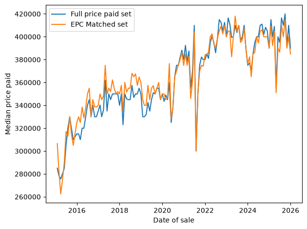
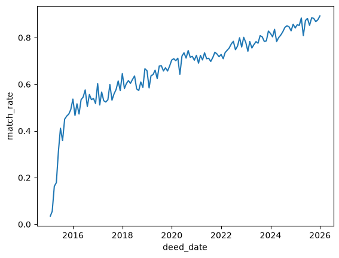

# Land registry price data (& EPC) analysis

## Part 3 - Datetime features and time-based checks

- Copied across subset joining method from Part 2
    - Removed filling of 'uprn' null values with '1' when casting to Int64. Count of price paid records matched to multiple EPC records unchanged (975)
- Dropped matching and helper columns after the join. IDs kept to allow rejoining to raw data (if needed)
    - Renamed property_type_x to property_subtype (contains letters denoting D = Detached, S = Semi-Detached, T = Terraced, F = Flats/Maisonettes, O = Other) and property_type_y to property_type (House, Maisonette, Flat etc)
    - Renamed 'time_to_sale' to 'inspection_to_sale' to remove ambiguity on which date used
- Dtype of date columns
    - deed_date
        - datetime64[ns]
        - 2015-01-07 to 2025-12-23
    - inspection_date
        - datetime64[ns]
        - 2013-10-31 to 2025-12-11
    - lodgement_date
        - datetime64[ns]
        - 2015-01-02 to 2025-12-13
- Converted 'inspection_to_sale' timedelta to int and binned in 'EPC_age_band'
        0-1 years     61097
        1-3 years     14484
        3-5 years      7388
        5-10 years     8090
        10 years+        91
    - 67% had EPC inspection in the year preceding sale, describing the property very close to its sale condition
    - The 10 year age limit is based on lodgement_date not deed_date (measured above). Added 'EPC_expired' flag to check against lodgement_date, 62 fail (< 0.07%).
        - *Proposed: keep with 'EPC_expired' flag and exclude from EPC feature analyses*
- Median monthly sale price in full raw price paid dataset and EPC matched dataset
    - Generated comparison table and lineplot
    - Lines track each other over the 11 year period, matched set is representative. But they get closer over time, with the first point significantly different

    

    - Plotting match_rate over time explains the trend. As it starts at < 4%, quickly reaches 50% then trends upward to 88% through the years. This is most likely due to the previously identified issue; as EPCs are valid for 10 years, the EPCs for earlier sales may have been outside the sample window.
        - The result of this is that future EPC-data based analyses will lean towards later years. In particular the 2015 data is strongly affected, so filtering to 2016 onward would be best.
        - Worth re-running the join with an EPC dataset that extends further back, best done during part 5 after pipeline building.
        
        

- Added date calendar features to joined/matched data (dayofweek, day, month, quarter, year)